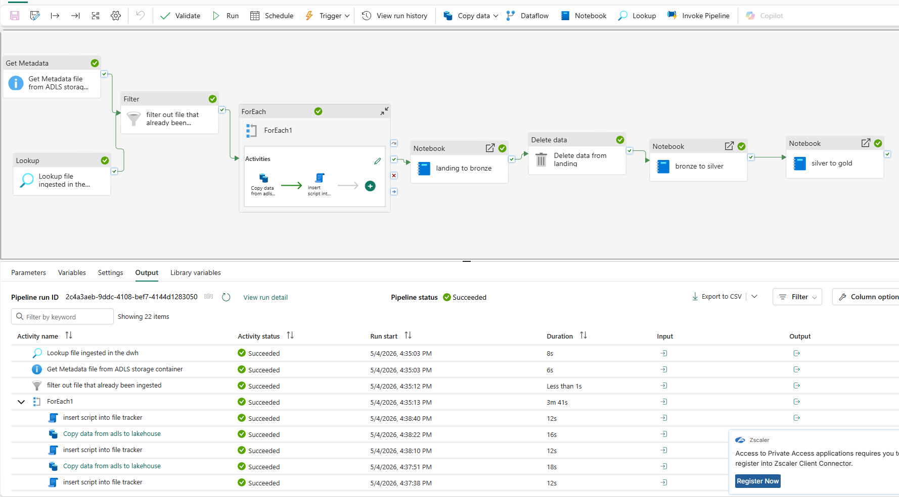
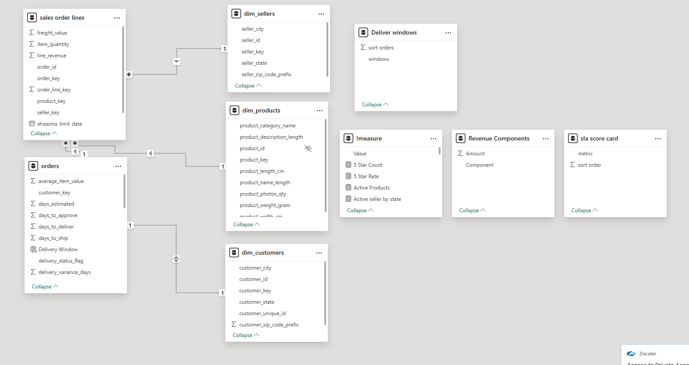
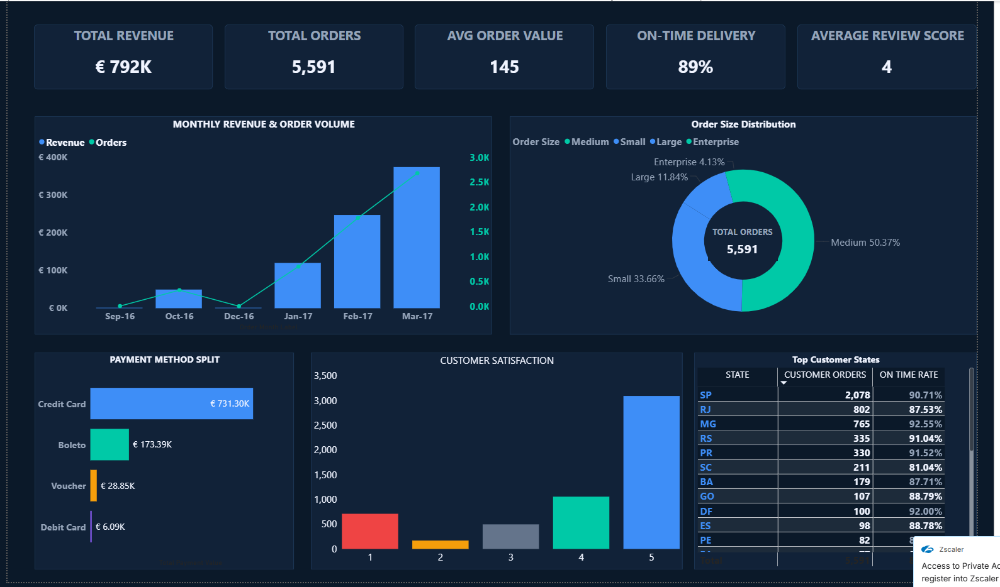
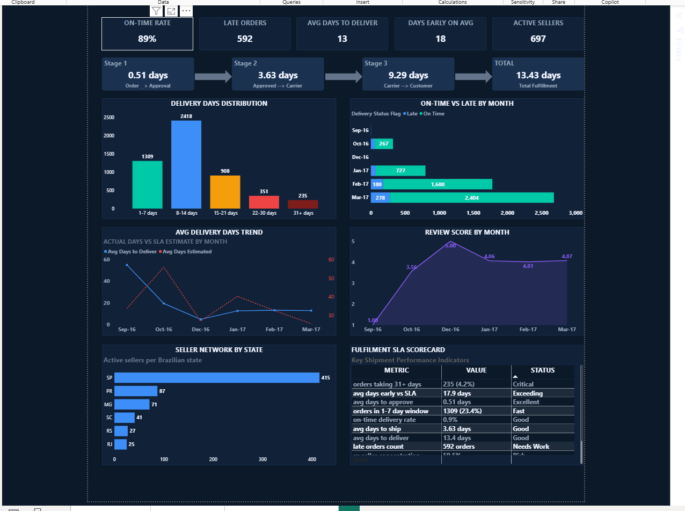
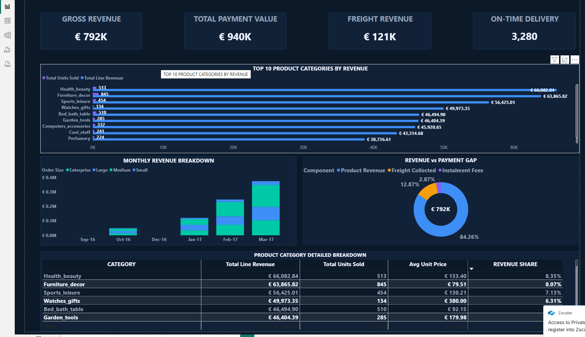

# Olist E-Commerce — End-to-End Data Engineering Platform


> **Technology Stack:** Python · ADLS Gen2 · Azure Data Factory · Microsoft Fabric · PySpark · Delta Lake · Power BI
>
> **Dataset:** Olist Brazilian E-Commerce · Sep 2016 to Mar 2017 · 5,591 Orders
>
> **Author:** Solomon Yakubu · Date: 4 May 2026

---

## Executive Summary

This project demonstrates the design and implementation of a production-grade end-to-end data engineering platform built on Microsoft Azure and Microsoft Fabric. Using the publicly available Olist Brazilian e-commerce dataset, a complete data pipeline was engineered from raw data ingestion through to interactive Power BI reporting.

The platform follows the industry-standard medallion architecture (Bronze, Silver, Gold) and showcases real-world data engineering patterns including batch ingestion, incremental loading, data quality validation, dimensional modelling, and automated pipeline orchestration.

### What This Project Demonstrates

- End-to-end data pipeline from raw CSV files to executive Power BI dashboards
- Automated batch ingestion from ADLS Gen2 into Microsoft Fabric Lakehouse using Azure Data Factory
- Multi-layer transformation (Bronze to Silver to Gold) using PySpark in Fabric Notebooks
- Fact constellation schema modelling with stable hash surrogate keys and upsert-based loading
- Three-page Power BI report covering Executive, Sales, and Operational performance
- Fully orchestrated pipeline with file tracking, deduplication, and automated cleanup

---

## Business Problem Statement

### Context

Olist is a Brazilian e-commerce company that operates a marketplace connecting small retailers with major Brazilian marketplaces. As the business scaled rapidly between 2016 and 2018 it accumulated transactional data across multiple operational systems covering orders, customers, products, sellers, payments, and customer reviews.

This data sat in disconnected flat files without a unified platform to support decision-making. Leaders and operations teams would like to have a solution that helps answer fundamental questions about revenue performance, delivery efficiency, customer satisfaction, or seller network health.

### Specific Problems Identified

- No single source of truth across orders, payments, reviews, sellers, and customers
- Monthly data files were inconsistent with mixed date formats, currency symbols, nulls, and duplicate records
- No visibility into delivery performance or which stages of fulfilment caused delays
- Revenue reporting was impossible without joining data across multiple disconnected files
- Customer review scores could not be correlated with operational metrics like delivery time
- Seller network geographic concentration risk was unquantified
- No automated ingestion process with no audit trail of what was loaded and when
- No scalable architecture to accommodate new monthly batches as the business grew

---

### The Goal and Objective

By building a unified automated data platform the business gains the ability to answer business questions from a single trusted source. A well-designed medallion architecture with automated monthly batch ingestion transforms static disconnected files into a living queryable data asset that updates as new data arrives each month.

---

## Solution Framework

The solution was designed around five sequential phases each building on the output of the previous. This framework ensures every layer serves a specific well-defined purpose and data moves through a controlled auditable path from raw source to business insight.

| Phase | Activity | Output |
|---|---|---|
| Phase 1 | Data preparation and batch splitting | Monthly CSV batches ready for ingestion |
| Phase 2 | ADLS ingestion and pipeline orchestration | Files tracked and landed in Fabric Lakehouse |
| Phase 3 | Medallion transformation Bronze to Silver to Gold | Clean modelled Delta tables in Warehouse |
| Phase 4 | Semantic model design | Star schema with DAX measures in Power BI |
| Phase 5 | Power BI report development | Three-page interactive business intelligence report |

### Why This Framework Was Chosen

- Medallion architecture separates raw, clean, and aggregated data making each layer independently testable and reprocessable
- Batch ingestion with a file tracker prevents duplicate loading and provides a full audit trail
- Delta Lake at Bronze and Silver enables ACID transactions, schema enforcement, and time travel
- Star schema at Gold optimises Power BI query performance and simplifies the data model for analysts
- Pipeline orchestration in Microsoft Fabric ensures the entire flow runs automatically without manual steps

---

## Phase 1 — Data Preparation and Batch Splitting

### Dataset

| Attribute | Detail |
|---|---|
| Source | Kaggle — Olist Brazilian E-Commerce Public Dataset |
| Tables | 9 interrelated CSV files |
| Date range | September 2016 to August 2018 |
| Project subset | 5,591 orders from Sep 2016 to Mar 2017 was processed using pipeline orchestration |
| Format | CSV files with mixed data quality issues |

### Why Batch Splitting Was Needed

Real-world data engineering pipelines do not receive all data at once. Data arrives incrementally monthly or daily. To simulate this production reality the full dataset was split into monthly files using the order purchase timestamp as the anchor. This mirrors exactly how a live Olist system would send data.

### Batch Splitting Script

```python
import pandas as pd
import os

os.makedirs('batches', exist_ok=True)

# Load all source tables
orders         = pd.read_csv('olist_orders_dataset.csv')
order_items    = pd.read_csv('olist_order_items_dataset.csv')
order_payments = pd.read_csv('olist_order_payments_dataset.csv')
order_reviews  = pd.read_csv('olist_order_reviews_dataset.csv')
customers      = pd.read_csv('olist_customers_dataset.csv')
products       = pd.read_csv('olist_products_dataset.csv')
sellers        = pd.read_csv('olist_sellers_dataset.csv')

# Parse date and create month-year partition key
orders['order_purchase_timestamp'] = pd.to_datetime(orders['order_purchase_timestamp'])
orders['year_month'] = orders['order_purchase_timestamp'].dt.to_period('M').astype(str)

for period, orders_batch in orders.groupby('year_month'):
    folder = f'batches/{period}'
    os.makedirs(folder, exist_ok=True)

    order_ids    = orders_batch['order_id'].unique()    # anchor key
    customer_ids = orders_batch['customer_id'].unique()
    batch_items  = order_items[order_items['order_id'].isin(order_ids)]

    orders_batch.drop(columns='year_month').to_csv(f'{folder}/orders-{period}.csv', index=False)
    batch_items.to_csv(f'{folder}/order_items-{period}.csv', index=False)
    order_payments[order_payments['order_id'].isin(order_ids)].to_csv(f'{folder}/order_payments-{period}.csv', index=False)
    order_reviews[order_reviews['order_id'].isin(order_ids)].to_csv(f'{folder}/order_reviews-{period}.csv', index=False)
    customers[customers['customer_id'].isin(customer_ids)].to_csv(f'{folder}/customers-{period}.csv', index=False)
    products[products['product_id'].isin(batch_items['product_id'].unique())].to_csv(f'{folder}/products-{period}.csv', index=False)
    sellers[sellers['seller_id'].isin(batch_items['seller_id'].unique())].to_csv(f'{folder}/sellers-{period}.csv', index=False)

    print(f'Batch {period} saved - {len(orders_batch)} orders')
```

---

## Phase 2 — Pipeline Orchestration (ADLS to Lakehouse)
---

---

### Overview

Data ingestion is orchestrated through a Microsoft Fabric Data Factory pipeline. The pipeline is fully automated, idempotent, and audit-tracked. It ran successfully on 04 May 2026 processing 22 activities in 3 minutes 41 seconds with all activities reporting Succeeded status.

### Pipeline Stages

| Step | Activity | Detail |
|---|---|---|
| 1 | **Get Metadata** — Retrieve file list from ADLS Gen2 | Calls the ADLS Gen2 container and retrieves metadata for every file present. Output is a childItems array of all file names available for ingestion. |
| 2 | **Lookup** — Query file tracker in Fabric Warehouse | Queries the file_tracker table to get all file names already successfully ingested. Prevents duplicate processing on reruns. Query: `SELECT file_name FROM file_tracker` |
| 3 | **Filter** — Exclude already-ingested files | Compares ADLS file list against the tracker. Only new files proceed. Expression: `@not(contains(string(activity('Lookup file ingested in the dwh').output.value), item().name))` |
| 4 | **ForEach** — Loop through new files | Iterates over each new file running Copy Data then Script activity. Script inserts: `INSERT INTO file_tracker (file_name, date_loaded) VALUES ('@{item().name}', GETUTCDATE())` |
| 5 | **Notebook** — Landing to Bronze | PySpark notebook reads each CSV from landing, validates row count, adds processing_date partition column, and writes as Delta to Bronze layer. |
| 6 | **Delete** — Clear landing folder | Deletes all files from landing after successful Bronze write. Only fires On Success of the Bronze notebook preventing accidental deletion of unprocessed files. |
| 7 | **Notebook** — Bronze to Silver then Silver to Gold | Triggers Bronze-to-Silver cleaning notebook followed by Silver-to-Gold dimensional modelling notebook in sequence. |

### File Tracker Table

```sql
-- Create file tracker in Fabric Warehouse
CREATE TABLE file_tracker (
    file_name    VARCHAR(255),
    date_loaded  DATE
);

-- Inserted by pipeline Script activity after each successful Copy:
INSERT INTO file_tracker (file_name, date_loaded)
VALUES ('@{item().name}', CAST(GETUTCDATE() AS DATE));

-- Used by Lookup activity to identify already-processed files:
SELECT file_name FROM file_tracker;
```

---

## Phase 3 — Medallion Architecture Transformation

---


---

### Layer Summary

| Layer | Location | Format | Purpose |
|---|---|---|---|
| Landing | Lakehouse Files/landing/ | CSV | Temporary staging — no transformation applied |
| Bronze | Lakehouse Files/bronze/ | Delta partitioned by processing_date | Raw faithful typed copy of source data |
| Silver | Lakehouse Tables/ | Delta with schema enforcement | Cleaned validated typed data with upsert merge |
| Gold | Fabric Warehouse dbo schema | Delta managed tables | Star schema with business metrics for reporting |

### Landing to Bronze — Key Code Pattern

```python
# Parameters passed from Fabric Pipeline at runtime
processed_date = ''   # e.g. '2026-04-29'
batch_month    = ''   # e.g. '2016-10'

df = spark.read.format('csv').option('header', 'true') \
     .load(f'Files/landing/customers-{batch_month}.csv')

row_count = df.count()

if row_count > 0:
    df = df.withColumn('processing_date', lit(processed_date))
    df.write.format('delta').partitionBy('processing_date') \
      .mode('append').save('Files/bronze/customers')
    print(f'Bronze write complete: {row_count} rows')
else:
    print('File contains no data - skipping')
```

### Silver Cleaning Functions

| Function | What It Does |
|---|---|
| `drop_duplicates(df, cols)` | Remove duplicate rows based on business key columns |
| `trim_whitespaces(df)` | Remove leading and trailing spaces from all string columns |
| `lower_case(df)` | Standardise all column headers to lowercase |
| `fill_null_desc(df, cols)` | Replace nulls in text columns with empty string |
| `fill_null_num(df, cols)` | Replace nulls in numeric columns with zero |
| `standardise_title_case(df, cols)` | Convert descriptive values to Title Case using initcap |
| `remove_special_char(df, cols)` | Strip special characters using regex pattern `[^a-zA-Z0-9]` |
| `standardise_dates(df, col)` | Parse multiple date formats into consistent timestamp using coalesce |
| `cast_column(df, type_map)` | Cast string columns to correct data types from a dictionary map |
| `standardise_column_values(df, col, map)` | Map known messy values to standardised versions using when/otherwise |
| `date_quality_check(df, col)` | Flag dates failing format validation as N keeping the row intact |

### Silver Upsert Pattern

```sql
-- MERGE pattern used for all Silver tables
MERGE INTO customer_silver AS target
USING new_customer_data AS source
ON target.customer_id = source.customer_id
   AND target.customer_unique_id = source.customer_unique_id

WHEN MATCHED THEN
    UPDATE SET
        target.customer_city            = source.customer_city,
        target.customer_state           = source.customer_state,
        target.customer_zip_code_prefix = source.customer_zip_code_prefix

WHEN NOT MATCHED THEN
    INSERT (customer_id, customer_unique_id, customer_zip_code_prefix,
            customer_city, customer_state)
    VALUES (source.customer_id, source.customer_unique_id,
            source.customer_zip_code_prefix, source.customer_city, source.customer_state);
```

### Gold Layer — Surrogate Key Generation

```python
# Stable surrogate keys using hash - same input always produces same key
dim_customers = customers_silver \
    .withColumn('customer_key', F.abs(F.hash(F.col('customer_id'))))

dim_products = products_silver \
    .withColumn('product_key', F.abs(F.hash(F.col('product_id'))))

dim_sellers = sellers_silver \
    .withColumn('seller_key', F.abs(F.hash(F.col('seller_id'))))

# Composite key for order lines
fact_order_lines = fact_order_lines.withColumn('order_line_key',
    F.abs(F.hash(F.concat(
        F.col('order_id'), F.col('product_id'),
        F.col('seller_id'), F.col('shipping_limit_date').cast('string')
    ))))
```

### Business Columns Added to fact_orders

| Column | Calculation | Business Purpose |
|---|---|---|
| `days_to_approve` | order_approved_at minus order_purchase_timestamp | Measures payment and fraud check speed |
| `days_to_ship` | order_delivered_carrier_date minus order_approved_at | Measures warehouse pick and pack time |
| `days_to_deliver` | order_delivered_customer_date minus order_purchase_timestamp | Total end-to-end fulfilment time |
| `days_estimated` | order_estimated_delivery_date minus order_purchase_timestamp | Promised delivery window to customer |
| `delivery_variance_days` | order_delivered_customer_date minus order_estimated_delivery_date | Negative is early, positive is late |
| `delivery_status_flag` | On Time if variance 0 or less, otherwise Late | SLA compliance flag for filtering |
| `order_month` | FORMAT of order_purchase_timestamp as yyyy-MM | Monthly trend grouping |
| `order_year` | YEAR of order_purchase_timestamp | Year-over-year comparison |
| `order_size` | Small, Medium, Large, Enterprise by revenue band | Revenue segmentation |
| `total_revenue` | SUM of line_revenue from order lines | Total product revenue per order |
| `total_freight` | SUM of freight_value from order lines | Total shipping cost per order |
| `avg_item_value` | AVG of unit_price from order lines | Average spend per item in order |

---

## Data Dictionary

The following tables document every column in the five Gold layer tables used in the Power BI semantic model. All tables reside in the Fabric Warehouse under the dbo schema.

### orders (fact_orders)

One row per customer order. Contains all order-level metrics, delivery performance calculations, and aggregated payment and review data.

| Column | Data Type | Source | Description | Example |
|---|---|---|---|---|
| order_key | BIGINT | Generated | Stable hash surrogate key for the order | 965681514 |
| order_id | VARCHAR | orders.csv | Original Olist order identifier (UUID) | 00125cb692d04887... |
| customer_key | BIGINT | Generated | Foreign key to dim_customers | 48318008 |
| order_status | VARCHAR | orders.csv | Current status of the order | Delivered |
| order_purchase_timestamp | TIMESTAMP | orders.csv | Date and time the customer placed the order | 2017-03-23 12:21:17 |
| order_approved_at | TIMESTAMP | orders.csv | Date and time the payment was approved | 2017-03-23 13:05:42 |
| order_delivered_carrier_date | TIMESTAMP | orders.csv | Date the order was handed to the carrier | 2017-03-27 08:58:04 |
| order_delivered_customer_date | TIMESTAMP | orders.csv | Date the customer received the order | 2017-04-07 15:32:47 |
| order_estimated_delivery_date | TIMESTAMP | orders.csv | Estimated delivery date shown to customer | 2017-04-20 00:00:00 |
| payment_type | VARCHAR | order_payments.csv | Primary payment method used | Credit Card |
| payment_installments | INTEGER | order_payments.csv | Number of payment instalments chosen | 1 |
| total_payment_value | DECIMAL | order_payments.csv | Total amount collected including fees | 135.41 |
| total_line_items | INTEGER | Calculated | Count of distinct order lines in this order | 1 |
| total_quantity | INTEGER | Calculated | Total units ordered across all lines | 1 |
| total_revenue | DECIMAL | Calculated | Sum of product prices across all lines | 109.90 |
| total_freight | DECIMAL | Calculated | Sum of freight charges across all lines | 25.51 |
| average_item_value | DECIMAL | Calculated | Average price per item in the order | 109.90 |
| days_to_approve | INTEGER | Calculated | Days from order placed to payment approved | 0 |
| days_to_ship | INTEGER | Calculated | Days from approval to carrier handoff | 4 |
| days_to_deliver | INTEGER | Calculated | Total days from order placed to delivery | 15 |
| days_estimated | INTEGER | Calculated | Days from order to estimated delivery date | 28 |
| delivery_variance_days | INTEGER | Calculated | Actual days minus estimated days. Negative means early | -13 |
| delivery_status_flag | VARCHAR | Calculated | On Time if delivered on or before estimate, otherwise Late | On Time |
| review_score | DECIMAL | order_reviews.csv | Average customer review score for this order | 5.0 |
| order_month | VARCHAR | Calculated | Year and month of purchase for trend grouping | 2017-03 |
| order_year | INTEGER | Calculated | Year of purchase for annual comparison | 2017 |

### sales_order_lines (fact_order_lines)

One row per distinct order line. An order line is a unique combination of order, product, seller, and shipping date. Multiple units of the same product are aggregated into a single line with a quantity count.

| Column | Data Type | Source | Description | Example |
|---|---|---|---|---|
| order_line_key | BIGINT | Generated | Stable composite hash surrogate key for the line | 22348626 |
| order_key | BIGINT | Generated | Foreign key to orders (fact_orders) | 1089955401 |
| order_id | VARCHAR | order_items.csv | Original Olist order identifier | 02b63408e665194f... |
| product_key | BIGINT | Generated | Foreign key to dim_products | 1575108526 |
| seller_key | BIGINT | Generated | Foreign key to dim_sellers | 1184336122 |
| item_quantity | INTEGER | Calculated | Count of units of this product in this order line | 1 |
| line_revenue | DECIMAL | Calculated | Total revenue for this line (unit_price x quantity) | 189.90 |
| unit_price | DECIMAL | order_items.csv | Price per individual unit of the product | 189.90 |
| freight_value | DECIMAL | order_items.csv | Total freight charge for this order line | 49.85 |
| shipping_limit_date | TIMESTAMP | order_items.csv | Latest date the seller must ship the item | 2017-03-22 08:53:48 |

### dim_customers

One row per unique customer. Contains customer demographic and location attributes.

| Column | Data Type | Source | Description | Example |
|---|---|---|---|---|
| customer_key | BIGINT | Generated | Stable hash surrogate key for the customer | 370415509 |
| customer_id | VARCHAR | customers.csv | Original Olist customer identifier per order | 00062b33cb9f6fe9... |
| customer_unique_id | VARCHAR | customers.csv | Unique identifier for the actual person across orders | f90f55ee274a4ae2... |
| customer_zip_code_prefix | INTEGER | customers.csv | First 5 digits of customer postal code | 2306 |
| customer_city | VARCHAR | customers.csv | City where the customer is located (Title Case) | Sao Paulo |
| customer_state | VARCHAR | customers.csv | Brazilian state abbreviation where customer is located | SP |

### dim_products

One row per unique product. Contains product catalogue attributes and physical dimensions.

| Column | Data Type | Source | Description | Example |
|---|---|---|---|---|
| product_key | BIGINT | Generated | Stable hash surrogate key for the product | 570366610 |
| product_id | VARCHAR | products.csv | Original Olist product identifier (UUID) | 001b72dfd63e9833... |
| product_category_name | VARCHAR | products.csv | Product category in English (Title Case) | Furniture_decor |
| product_name_length | INTEGER | products.csv | Character length of the product name field | 45 |
| product_description_length | INTEGER | products.csv | Character length of the product description | 520 |
| product_photos_qty | INTEGER | products.csv | Number of product photos listed | 3 |
| product_weight_gram | BIGINT | products.csv | Product weight in grams | 600 |
| product_length_cm | INTEGER | products.csv | Product length in centimetres | 26 |
| product_width_cm | INTEGER | products.csv | Product width in centimetres | 22 |
| product_height_cm | INTEGER | products.csv | Product height in centimetres | 15 |

### dim_sellers

One row per unique seller. Contains seller location and identification attributes.

| Column | Data Type | Source | Description | Example |
|---|---|---|---|---|
| seller_key | BIGINT | Generated | Stable hash surrogate key for the seller | 2091681980 |
| seller_id | VARCHAR | sellers.csv | Original Olist seller identifier (UUID) | 001cca7ae9ae17fb... |
| seller_zip_code_prefix | INTEGER | sellers.csv | First 5 digits of seller postal code | 29156 |
| seller_city | VARCHAR | sellers.csv | City where the seller is located (Title Case) | Cariacica |
| seller_state | VARCHAR | sellers.csv | Brazilian state abbreviation where seller operates | ES |

### Disconnected Reference Tables

Three additional tables exist in the semantic model without relationships to the fact or dimension tables. They support specific Power BI visualisations via the SWITCH and SELECTEDVALUE DAX pattern.

| Table | Columns | Purpose |
|---|---|---|
| Deliver Windows | Window (STRING), Sort Order (INTEGER) | Ordered labels for delivery window distribution chart: 1-7 days through 31 plus days |
| Revenue Components | Component (STRING), Amount (measure) | Category labels for the revenue versus payment donut chart |
| SLA Score Card | Metric (STRING), Sort Order (INTEGER) | Ordered row labels for the fulfilment scorecard table on Operations page |

---

## Phase 4 — Semantic Model
---



---

## Phase 5 — Power BI Report

---

## Report Pages

### Executive Overview




### Order Shipment Performance




### Sales Performance



---
### Report Pages

| Page | Audience | Key Metrics |
|---|---|---|
| Executive Overview | C-suite and senior leadership | Total Revenue R$792K, 5,591 orders, on-time rate 89.4%, review score 4.02, revenue growth trend |
| Sales Performance | Sales and product teams | Top 10 categories by revenue, unit economics, monthly breakdown by order size, revenue vs payment gap |
| Order and Shipment Performance | Logistics and operations | Delivery pipeline stages, SLA scorecard, seller network, on-time vs late by month, review trend |

### Relationships

| From Table | Key | To Table | Cardinality |
|---|---|---|---|
| orders | customer_key | dim_customers.customer_key | Many-to-One |
| sales_order_lines | order_key | orders.order_key | Many-to-One |
| sales_order_lines | product_key | dim_products.product_key | Many-to-One |
| sales_order_lines | seller_key | dim_sellers.seller_key | Many-to-One |

---

### Key DAX Measures

```dax
-- Revenue and Volume
Total Revenue       = SUM(orders[total_revenue])
Total Orders        = COUNTROWS(orders)
Avg Order Value     = AVERAGE(orders[total_revenue])
Total Payment Value = SUM(orders[total_payment_value])
Total Freight       = SUM(orders[total_freight])
Active Products     = DISTINCTCOUNT(sales_order_lines[product_key])
Active Sellers      = DISTINCTCOUNT(dim_sellers[seller_id])

-- Delivery and SLA
On Time Rate        = DIVIDE(COUNTROWS(FILTER(orders, orders[delivery_status_flag] = "On Time")), COUNTROWS(orders)) * 100
Late Orders         = COUNTROWS(FILTER(orders, orders[delivery_status_flag] = "Late"))
Avg Days to Deliver = AVERAGE(orders[days_to_deliver])
Avg Days to Approve = AVERAGE(orders[days_to_approve])
Avg Days to Ship    = AVERAGE(orders[days_to_ship])
Avg Days Early      = ABS(AVERAGE(orders[delivery_variance_days]))
Last Mile Days      = [Avg Days to Deliver] - [Avg Days to Ship] - [Avg Days to Approve]

---

### Key Findings

- Total revenue of R$792K across 5,591 orders from September 2016 to March 2017
- 89.4% of orders delivered on time with 592 late orders requiring investigation
- Average delivery of 13.4 days versus 31.7 days estimated — orders arrive 17.9 days early on average
- Last mile accounts for 69% of total delivery time and is the primary fulfilment bottleneck
- Health beauty is the top revenue category at R$66K despite not having the highest unit volume
- Watches gifts achieves the highest average unit price at R$373 - a premium scaling opportunity
- 59.5% of sellers are based in Sao Paulo state creating geographic concentration risk
- Review score improved from 3.56 in October 2016 to 4.07 by March 2017 as operations matured
- Credit card accounts for 79.6% of total payment value at R$731K

---

